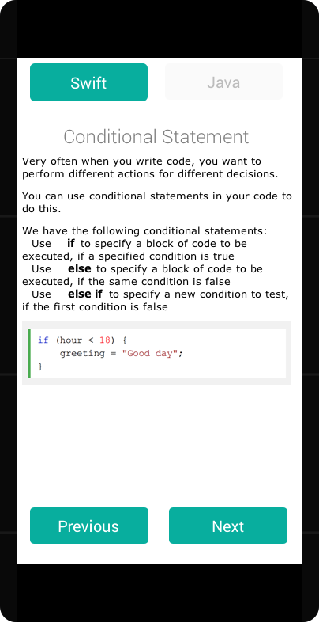
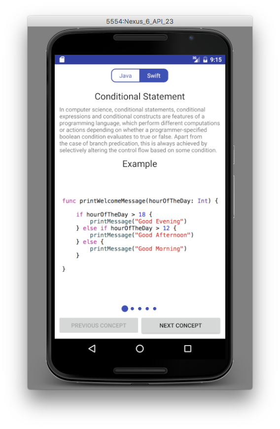

# 5 Development Concepts
Application design to display the 5 development concepts including:
1. if statements
2. switch statements
3. for loop
4. while loop
5. enumerators

Application includes a short description of the concept as well as examples in Java and Swift programming languages.

Everything required to run the application is included into this repository, just open it with Android Studio and click the run button.

## Application mock

## Application screenshot
